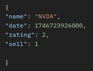
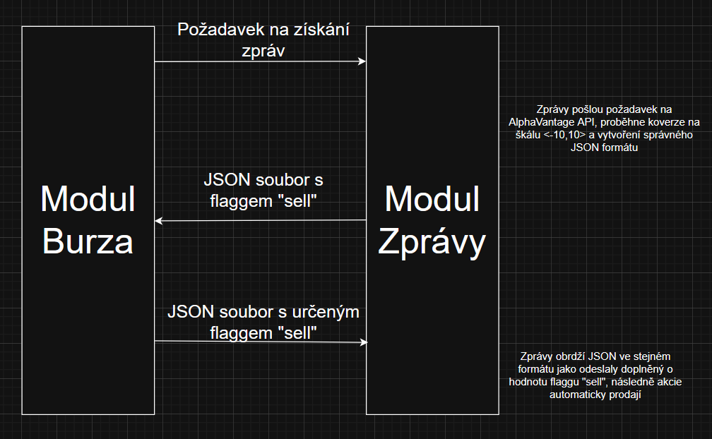

# Modul Zprávy

## Tým
Filip Plass

Vítězslav Musil

## Účel
Hlavní účel modulu Zprávy je pomocí komunikace s modulem Burza automatická správa akcií.
Po obdržení requestu od modulu Burza modul Zprávy získá aktuální/historická data
z API, evaluuje na škále <-10,10> a odešle zpět Burze. Burza následně pošle zpátky
stejná data s určením, zda-li se mají akcie prodat či nikoli.
Zprávy posléze prodají akcie určené k prodeji.

## Uživatelské požadavky

### 1 Uživatelské rozhraní
    - Minimální UI splňující funkční požadavky
    - CSS knihovna Bootstrap
    - Šablony Spring Boot Thymeleaf

### 2 Persistence dat
    - Veškerá data jsou uložena v externí databázi
    - Relační řešení
    - Mazání starých dat neimplementováno

### 3 Stahování dat
    - Data se stahují periodicky (Výchoze každých 12 hodin)
    - Výchoze se stahují data u aktuálního dne +  výchoze 3 dny zpět
    - Data se stahují inkrementálně (Nestahují se již stažená data)
    - Jak moc do minulosti stahovat historická data lze nastavit v konfiguračním souboru

### 4 Externalizace konfigurace
    - Interní kofigurační soubor
    - Období stahování dat, maximální a minimální počet zpráv atd.

### 5 Struktura souboru JSON

### 6 API
    - Zprávy se získávají z API AlphaVantage
    - AlphaVantage disponuje vlastním hodnocením zpráv
    - Modul Zprávy dané hodnocení převádí na celá čísla na škálě <-10,10>

### 7 Timeouty při prodlevě požadvků z REST API
    - Modul Zprávy se ptá každých deset sekund, to až pětkrát
    - Při neúspěchu se požadování neopakuje

### 8 Limity zpráv
    - Výchozí minimum je 10 zpráv
    - Výchozí maximum je 50 zpráv
    - Nastavitelné v konfiguračním souboru

### 9 Endpointy
| Endpoint|Účel|
|:---------------|:----|
| /index | Hlavní stránka  |
| /register | Registrační formulář  |
| /register/save | Ukládá nově registrovaného uživatele  |
| /logout | Potvrzení odhlášení |
| /users | Vypíše veškeré uživatele |
| /login | Přihlašovací obrazovka |
| /api/sentiment | Zobrazí zprávy AlhaVantage | 
| /ratings | Vypíše celkové hodnocení na škále <-10,10> |
| /evaluate | Vypíše zda-li zprávy odpovídají kritériím a uloží je |
| /api/stocks/list | Vypíše akcie uživatele |
| /api/stocks/list/favourite | Vypíše oblíbené akcie uživatele |
| /api/stocks/add | Přidá akcii uživateli |
| /api/update/\{id\} | Prodává/nakupuje akcie |
| /api/updateFromApi | Prodává/nakupuje akcie, utilizován modulem Burza |
| /api/triggerEvaluateNews | Manuální spuštění /evaluate |
## Komunikační schéma
